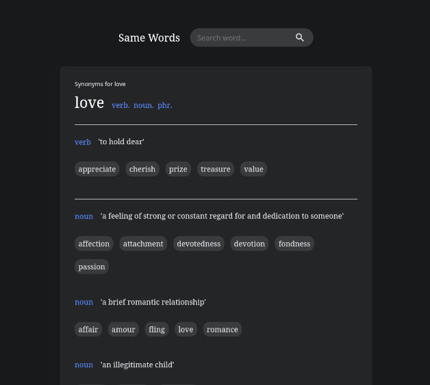

# Same Words

[View website](https://samewords.netlify.app/).

Same words is a web application to view synonyms. The data is from Merriam-Webster Dictionary API and can be found [here](https://dictionaryapi.com/).

<p align='center'>

</p>

### Technologies Used

- ReactJS
- React Hooks (No class based components)
- React Router
- Netlify Functions
- Styled Components

### Features

- View synonyms for your chosen word (thats it 😢)
- Error handling
- Data from Merriam-Webster Dictionary Api

### How to Use

1. Clone repo then install packages and run development server.

```sh
$ npm install
$ npm start
```

2. Provide your own Merriam-Webster api key in an env file.

```sh
REACT_APP_API_KEY='your_key'
```

## About

I made this web application to practice using Styled Components and React Hooks. I wanted to deepen my understanding of hooks especially useEffect. I also hidden my api key by utilizing Netlify Functions. All css code is made by me except the heart loader. Designs are inspired from current famous synonym sites.

The api can only handle 1000 requests per day because that is the limit of the Merriam-Webster dictionary API. I might create my own api in the future to remove this limitation if the need arise.
